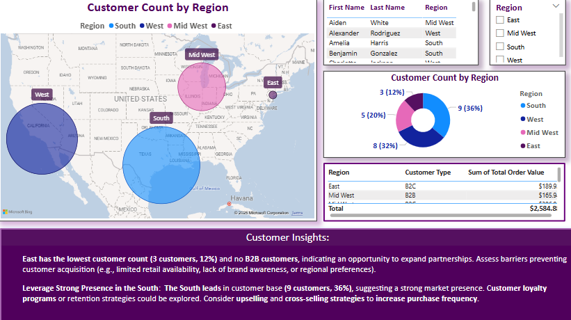
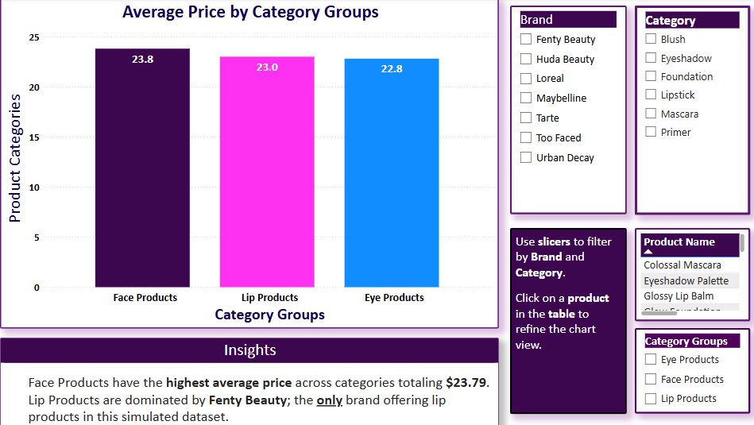
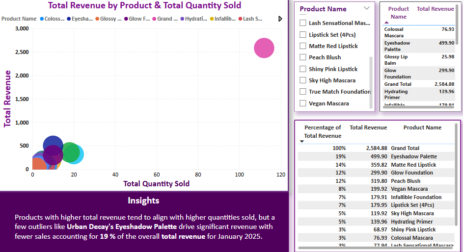

# Beauty & Cosmetics Sales Performance and Analytics Dashboard

## Description

This project presents a comprehensive Power BI analysis of beauty and cosmetics sales performance across multiple dimensions, including customer behavior, supplier performance, pricing trends, and regional sales distribution. Built on a **simulated dataset**, it reflects real-world brands, categories, and customer dynamics—designed to simulate retail analytics conditions and showcase end-to-end **business intelligence strategy development**.

A core component of this project was the creation of a dynamic relational data model in Power BI, using fact-dimension relationships to enable segmentation, inventory optimization, and strategic insight generation. This project was developed as part of a broader portfolio to demonstrate BI skill sets, analytical storytelling, and decision-ready reporting frameworks.

---

## Tools, Techniques, and Analytical Logic Used

- **Power BI**: Developed the full dashboard using custom visuals, slicers, tooltip layers, DAX-based cards, and interactive filters.
- **SQL (SSMS)**: Used for structuring tables, creating customer spend metrics, and prepping the dataset for import.
- **Excel**: Used for ETL cleanup, category grouping logic, and modeling `Customer Segmentation by Tier`.
- **ETL Workflow**: Structured raw data across products, orders, suppliers, and customers for seamless relational modeling.
- **Data Model Relationships**: Connected dimension and fact tables through one-to-many relationships across orders, customers, inventory, and suppliers.
- **Customer Segmentation Table**: Created to segment by spend tiers (High, Medium, Low); used to power visual filters and insights.
- **Customer Spend Behavior Analysis**: Built using `Total Order Value`, `Average Order Value`, and purchase frequency logic.
- **Price Tiering Analysis**: Compared pricing bands across prestige and drugstore brands for pricing strategy modeling.
- **Inventory & Supplier Dependency Metrics**: Visualized inventory concentration and supplier contributions to model risk exposure.

---

## Key Features
- **Comprehensive Sales Analysis**: Insights into customer behavior, product performance, and revenue trends.
- **Interactive Visualizations**: Dashboards with slicers, filters, and drill-down capabilities.
- **Regional Performance Insights**: Geographical analysis of sales distribution.
- **Product & Supplier Analysis**: Understanding brand performance, category-level trends, and supplier contributions.

---

## 🟪 Report Design Features & Iterative BI Development

This Power BI dashboard was developed using an **iterative business intelligence design approach**, treating the report as a living product. Design features include:

- An **Introductory Overview Page** to orient users
- A **Dashboard Navigation Panel** for seamless page flow
- A **Story Page** to showcase narrative-driven insights
- A dedicated **Insights & Recommendations section**
- A final **Conclusion & Strategic Growth View**

These components simulate a polished, client-facing reporting experience while guiding the end user through insight discovery.

🟦 *Note on Cross-Platform Differences*: This report takes advantage of Power BI's flexible text-based layout options. In Tableau, where blank narrative pages are not native, similar layouts may use text boxes on blank dashboards. Each report iteration adapts to the platform’s strengths while remaining consistent in its strategic structure.

---

## 🟩 Interactive Power BI Dashboard  

[📎 View the Full Strategic Business Intelligence Report (PDF)](./Beauty_Cosmetics_PowerBI_Report/Beauty_Cosmetics_Sales_Performance_Analysis_Report.pdf)

This interactive Power BI report provides insights into beauty and cosmetics sales trends, customer segmentation, supplier performance, and inventory insights.

## Screenshots

  
*Customer Insights Dashboard - Focused on Customers*

  
*Average Price by Category Groups - Focused on Price Segmentation*

  
*Product Insights - Focused on Products; groups and categories*

## Future Enhancements
This project is part of a broader portfolio. Future phases will include:
- **Tableau**: Advanced visualizations and dashboards with the same dataset for comparative insights.
- **R Programming**: Statistical analysis and visualization of larger beauty industry datasets.
- **Expanded Dataset Analysis**: Incorporating additional months and product categories to provide deeper insights into trends and performance.

## How to Use
- Clone this repository to your local system.
- Open the Power BI file to explore the visualizations and insights.

## Disclaimer
The dataset used in this project is entirely **simulated and fictitious**. While the dataset is inspired by real-world brands, products, and categories, it was fabricated solely for the purpose of demonstrating data analysis and business intelligence skills. Any resemblance to actual sales data or business performance is purely coincidental.
